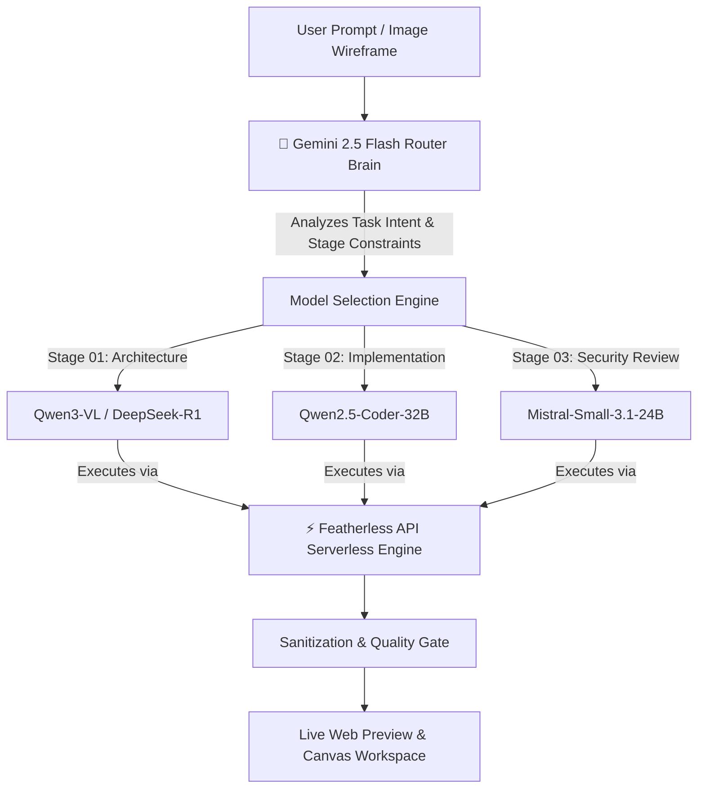

# 🪶 FeatherRouter

> **Intelligent Multi-Agent Open Model Routing Engine**  
> *Built for the Impact Forge Hackathon — Powered by Gemini 2.5 & Featherless API*

[](https://nextjs.org/)
[](https://featherless.ai/)
[](https://ai.google.dev/)
[](LICENSE)

---

## 💡 The Problem

Most AI coding applications lock users into a single monolithic model (e.g. GPT-4o or Claude Sonnet). However, **no single model is optimal for all stages of software development**:
- Large vision-language models excel at visual architecture planning.
- Code-specialized models (`Qwen2.5-Coder-32B`) drastically outperform general chat models at syntax and logic generation.
- Reasoning models (`DeepSeek-R1`) excel at edge-case detection and security auditing.

---

## 🚀 The Solution: FeatherRouter

**FeatherRouter** is an explainable multi-agent routing system that dynamically breaks down coding tasks across specialized open-source models:



---

## ✨ Key Features

### 1. 🧠 Dual-Layer Agent Architecture
- **Cognitive Router Brain (Gemini 2.5 Flash):** Evaluates task complexity, stage requirements, and model specializations in real-time (~1.2s) to choose the optimal open-source model.
- **Model Execution Engine (Featherless API):** Runs the selected model against 21,700+ serverless open models.

### 2. 📊 Transparent & Explainable Decision Engine
- Inspectable decision panel rendering exact score breakdowns (`/100`), signals evaluated, latency timings, and natural language routing rationale for every stage.

### 3. 🛡️ Self-Healing & Cascading Fallback Queue
- Stage quality gates validate output syntax before accepting completions.
- Evaluates a 5-candidate fallback queue in Quality Mode to automatically recover from model timeouts or transient errors.

### 4. 🎨 Modern Canvas & Live Preview Environment
- **Live Web Preview:** Instant iframe browser preview for HTML/CSS/JS base web apps with auto-injected Tailwind polyfills.
- **Code Sanitizer:** Automated post-processor that strips trailing LLM prose commentary to prevent runtime `SyntaxError` crashes.
- **Local Deployment Modal:** Clean setup guide for Next.js, React, and Python projects.

### 5. 🖼️ Multi-Modal Wireframe Parsing
- Drag-and-drop or `Ctrl+V` clipboard image upload with client-side canvas compression down to max 1024px JPEG (~90KB).

---

## 🛠️ Getting Started

### Prerequisites
- Node.js 18.x or higher
- A [Featherless API](https://featherless.ai/) Key
- A [Google Gemini API](https://ai.google.dev/) Key (Optional, for Gemini routing brain)

### Environment Setup

Create a `.env.local` file in the root directory:

```env
FEATHERLESS_API_KEY=your_featherless_api_key_here
GEMINI_API_KEY=your_gemini_api_key_here
```

### Installation

```bash
# Clone repository
git clone https://github.com/sangamgautam1111/feather-router.git
cd feather-router

# Install dependencies
npm install

# Run development server
npm run dev
```

Open [http://localhost:3000](http://localhost:3000) in your browser.

---

## 🧪 Production Build Verification

```bash
# Run TypeScript compilation and static page generation
npm run build
```

---

## 📜 License

MIT License © 2026 FeatherRouter Team. Built for the Impact Forge Hackathon.
